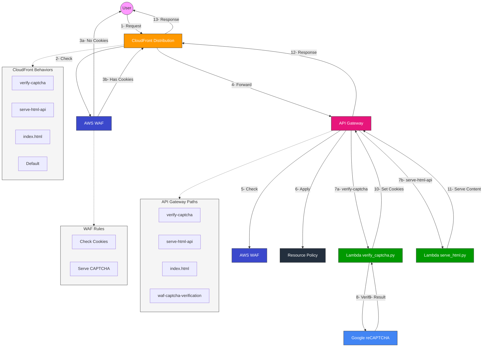

# AWS WAF with Google reCAPTCHA Architecture (Split Diagram)

## User Flow Diagram



## Architecture Components Diagram

```mermaid
flowchart TB
    %% Define styles
    classDef cloudfront fill:#FF9900,stroke:#333,stroke-width:2px,color:white
    classDef waf fill:#3B48CC,stroke:#333,stroke-width:2px,color:white
    classDef apigateway fill:#E7157B,stroke:#333,stroke-width:2px,color:white
    classDef lambda fill:#009900,stroke:#333,stroke-width:2px,color:white
    classDef policy fill:#232F3E,stroke:#333,stroke-width:2px,color:white
    
    %% Define main components
    CF[CloudFront Distribution]:::cloudfront
    WAF1[AWS WAF]:::waf
    APIGW[API Gateway]:::apigateway
    WAF2[AWS WAF]:::waf
    RP[Resource Policy]:::policy
    
    %% Define Lambda functions
    LambdaVerify[Lambda@Edge\nverify_captcha.py]:::lambda
    LambdaServe[Lambda\nserve_html.py]:::lambda
    
    %% Define CloudFront behaviors
    subgraph CFBehaviors[CloudFront Behaviors]
        direction TB
        B1["/verify-captcha\n→ API Gateway"]
        B2["/serve-html-api\n→ API Gateway"]
        B3["/index.html\n→ API Gateway"]
        B4["/ (Default)\n→ Custom Error Page"]
    end
    
    %% Define API Gateway paths
    subgraph APIPaths[API Gateway Paths]
        direction TB
        P1["/verify-captcha\n→ Lambda"]
        P2["/serve-html-api\n→ Lambda"]
        P3["/index.html\n→ Lambda"]
        P4["/waf-captcha-verification\n→ Lambda"]
    end
    
    %% Define WAF rules
    subgraph WAFRules[WAF Rules]
        direction TB
        R1["Check for Cookies:\n- aws-waf-token=true\n- captcha_verified=true"]
        R2["If No Cookies:\nServe CAPTCHA Page"]
    end
    
    %% Define Resource Policy
    subgraph ResourcePolicy[Resource Policy]
        direction TB
        RP1["Allow: CloudFront IPs"]
        RP2["Allow: Specific IPs"]
        RP3["Deny: All Others"]
    end
    
    %% Connect components
    CF --- WAF1
    CF --- APIGW
    APIGW --- WAF2
    APIGW --- RP
    APIGW --- LambdaVerify
    APIGW --- LambdaServe
    
    %% Connect subgraphs
    CF -.-> CFBehaviors
    APIGW -.-> APIPaths
    WAF1 -.-> WAFRules
    RP -.-> ResourcePolicy
    
    %% Apply styles
    classDef subgraph fill:#f5f5f5,stroke:#333,stroke-width:1px
    class CFBehaviors,APIPaths,WAFRules,ResourcePolicy subgraph
```

## Detailed Flow

1. **Initial Request**:
   - User attempts to access protected content
   - CloudFront forwards request to AWS WAF
   - WAF checks for required cookies
   - If cookies are missing, WAF serves the Google reCAPTCHA challenge page

2. **CAPTCHA Verification**:
   - User completes the CAPTCHA challenge
   - JavaScript sends the CAPTCHA token to `/verify-captcha`
   - CloudFront forwards the request to API Gateway
   - API Gateway invokes the `verify_captcha.py` Lambda function
   - Lambda verifies the token with Google reCAPTCHA service
   - If valid, Lambda sets cookies and returns a redirect response

3. **Authenticated Access**:
   - User is redirected with cookies set
   - CloudFront forwards the new request to WAF
   - WAF checks for cookies and allows the request
   - CloudFront forwards to API Gateway based on the path
   - API Gateway invokes the appropriate Lambda function
   - `serve_html.py` verifies cookies again and serves protected content

## Security Measures

1. **Dual WAF Protection**:
   - WAF at CloudFront level for initial cookie verification
   - WAF at API Gateway level for additional protection

2. **Resource Policy**:
   - Restricts API Gateway access to CloudFront and specific IPs
   - Prevents direct access to API Gateway endpoints

3. **Cookie Verification**:
   - Both WAF and Lambda functions verify the presence of required cookies
   - Cookies are set with secure attributes

4. **Custom Headers**:
   - CloudFront adds custom headers for API Gateway authorization

5. **HTTPS Throughout**:
   - All communications use HTTPS for encryption
