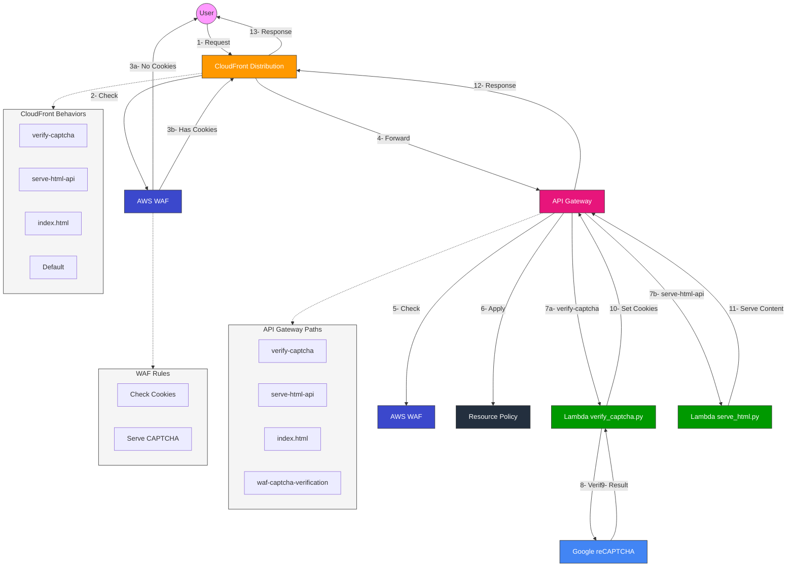

# AWS WAF with Google reCAPTCHA Architecture (Split Diagram)

## User Flow Diagram

## Architecture Components Diagram

```mermaid

graph TB
    User((User))
    CF[CloudFront]
    WAF1[WAF]
    APIGW[API Gateway]
    WAF2[WAF]
    RP[Policy]
    LV[Lambda1]
    LS[Lambda2]
    Google[reCAPTCHA]
    
    User --> CF
    CF --> WAF1
    WAF1 --> User
    WAF1 --> CF
    
    CF --> APIGW
    APIGW --> WAF2
    APIGW --> RP
    
    APIGW --> LV
    APIGW --> LS
    
    LV --> Google
    Google --> LV
    
    LV --> APIGW
    LS --> APIGW
    APIGW --> CF
    CF --> User
    
    subgraph CFB[CloudFront]
        B1[Path1]
        B2[Path2]
    end
    
    subgraph API[API Paths]
        P1[Path1]
        P2[Path2]
    end
    
    subgraph Rules[WAF Rules]
        R1[Rule1]
        R2[Rule2]
    end
    
    CF -.-> CFB
    APIGW -.-> API
    WAF1 -.-> Rules
    
    style User fill:#f9f
    style CF fill:#FF9900
    style WAF1 fill:#3B48CC
    style WAF2 fill:#3B48CC
    style APIGW fill:#E7157B
    style LV fill:#009900
    style LS fill:#009900
    style Google fill:#4285F4
    style RP fill:#232F3E
    style CFB fill:#f5f5f5
    style API fill:#f5f5f5
    style Rules fill:#f5f5f5

```

## Detailed Flow

1. **Initial Request**:
   - User attempts to access protected content
   - CloudFront forwards request to AWS WAF
   - WAF checks for required cookies
   - If cookies are missing, WAF serves the Google reCAPTCHA challenge page

2. **CAPTCHA Verification**:
   - User completes the CAPTCHA challenge
   - JavaScript sends the CAPTCHA token to `/verify-captcha`
   - CloudFront forwards the request to API Gateway
   - API Gateway invokes the `verify_captcha.py` Lambda function
   - Lambda verifies the token with Google reCAPTCHA service
   - If valid, Lambda sets cookies and returns a redirect response

3. **Authenticated Access**:
   - User is redirected with cookies set
   - CloudFront forwards the new request to WAF
   - WAF checks for cookies and allows the request
   - CloudFront forwards to API Gateway based on the path
   - API Gateway invokes the appropriate Lambda function
   - `serve_html.py` verifies cookies again and serves protected content

## Security Measures

1. **Dual WAF Protection**:
   - WAF at CloudFront level for initial cookie verification
   - WAF at API Gateway level for additional protection

2. **Resource Policy**:
   - Restricts API Gateway access to CloudFront and specific IPs
   - Prevents direct access to API Gateway endpoints

3. **Cookie Verification**:
   - Both WAF and Lambda functions verify the presence of required cookies
   - Cookies are set with secure attributes

4. **Custom Headers**:
   - CloudFront adds custom headers for API Gateway authorization

5. **HTTPS Throughout**:
   - All communications use HTTPS for encryption
